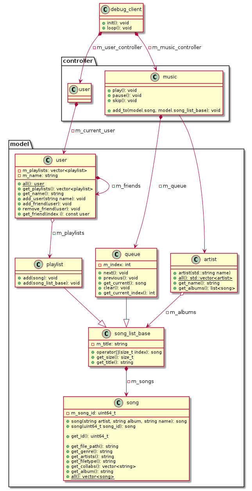
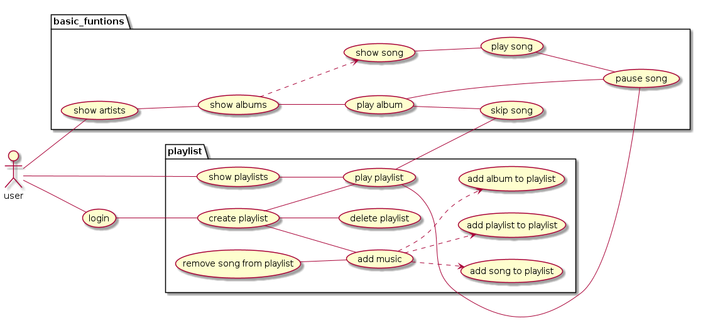

# spotivy

## Documentatie





## include guards

Include guards worden geïmplementeerd met de volgende syntax

```cpp
#ifndef SPOTIVY_NAMESPACES_CLASSNAME_H
#define SPOTIVY_NAMESPACES_CLASSNAME_H

#endif // SPOTIVY_NAMESPACE_CLASSNAME_H
```

voorbeeld:

```cpp
#ifndef SPOTIVY_MODEL_SONG_H
#define SPOTIVY_MODEL_SONG_H

namespace model {
    class song {

    }
} // model

#endif // SPOTIVY_MODEL_SONG_H
```

## Bestandsstructuur

De bestandsstructuur moet volgens het volgende voorbeeld worden uitgevoerd:

```bash
├── include
│   └── namespace
│       └── class.h
└── src
    └── namespace
        └── class.cpp
```

## Werkafspraken

De volgende regels zijn gehanteerd:
*   Wanneer iemand niet aanwezig, wordt aangegeven aan de andere medestudenten en wordt er door gewerkt door de medestudenten.*
*   Wanneer iemand niet verder kan, omdat hij/zij hulp nodig heeft van een medestudent die er niet is, pakt deze student een andere use-case op.

## Git

De volgende regels met betrekking tot de git worden gehanteerd:
*   Er word NOOIT direct naar de main gepusht
*   Er word voor elke feature en/of classe een branch aangemaakt
*   Een merge vanuit branch X naar develop wordt alleen gedaan vanuit git pull request of met overleg, zodat de kwaliteit gewaarborgd blijft.


## Bijlages

* [trello](https://trello.com/c/EfcjRw2A/29-usecase-diagram)
* [git](https://github.com/Noud-Janssen/spotivy)
* [use cases](https://rocnijmegen2-my.sharepoint.com/:w:/r/personal/1201597_student_roc-nijmegen_nl/_layouts/15/doc2.aspx?sourcedoc=%7B6496A119-ADE7-4F28-A7E5-B9224F321FE4%7D&file=usecase%20table.docx&action=default&mobileredirect=true&DefaultItemOpen=1&ct=1719396695028&wdOrigin=OFFICECOM-WEB.MAIN.REC&cid=1f1683b0-f821-40ee-b22a-68fdd52b379d&wdPreviousSessionSrc=HarmonyWeb&wdPreviousSession=0f016825-c2de-4348-b8b0-3e401adfe060)